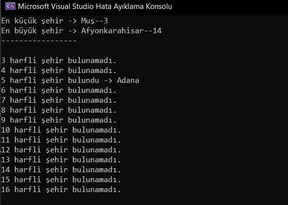

1-	Türkiye illerinin karakter uzunluklarının en az olanının ve en çok olanını bulunuz?
2-	En az karakterli il sayısı kadar il rastgele seçiniz? Örneğin VAN üç karakterli üç il rast gele seçilecek seçilen illerin aynı indisli elemanlarının üç harfli il ismi oluşturana kadar veya 100000 denemeye kadar deneme yapılacak,
3-	2. Aşamada yaptığımız işlemi sırası ile 4, 5 , 6, ..  maksimum harfli il karakter sayısına kadar tekrarlayınız?
4-	Her bir bulunan ili program sonunda yazdırınız. İl bulunamamış olan denemeler için Bulunamadı yazdırınız?

 
 